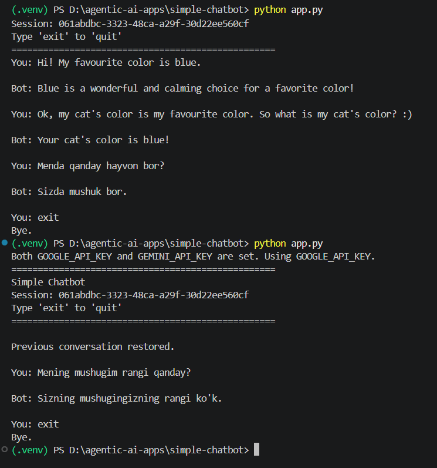

# Simple Chatbot with Google GenAI

A simple CLI chatbot built with **Python**, **Google GenAI**, and **SQLite**. The application stores every conversation in a database and automatically restores the latest session when restarted.

---

## Features

- Chat with Google Gemini
- Store all messages in SQLite
- Automatic session recovery
- Conversation history persistence
- Simple command-line interface
- Modular project structure

---

## Project Structure

```text
simple-chatbot/
│
├── app.py
├── chatbot.py
├── database.py
├── chat.db
├── requirements.txt
├── .env
└── README.md
```

---

## Installation

Clone the repository.

```bash
git clone https://github.com/Sanjarbek1024/simple-chatbot.git
cd simple-chatbot
```

Create a virtual environment.

```bash
python -m venv .venv
```

Activate it.

Windows

```bash
.venv\Scripts\activate
```

macOS / Linux

```bash
source .venv/bin/activate
```

Install dependencies.

```bash
pip install -r requirements.txt
```

---

## Environment Variables

Create a `.env` file.

```env
GOOGLE_API_KEY=YOUR_API_KEY
```

---

## Run

```bash
python app.py
```

Type `exit` to end the application.

---

## Database

Each message is stored with:

- Session ID
- Role (user / assistant)
- Message
- Timestamp

The chatbot restores the most recent session automatically when the application starts again.

---

## Demo

### Chat Conversation and Conversation Recovery



---

## Technologies

- Python
- Google GenAI
- SQLite
- python-dotenv

---

## License

This project is created for learning purposes.